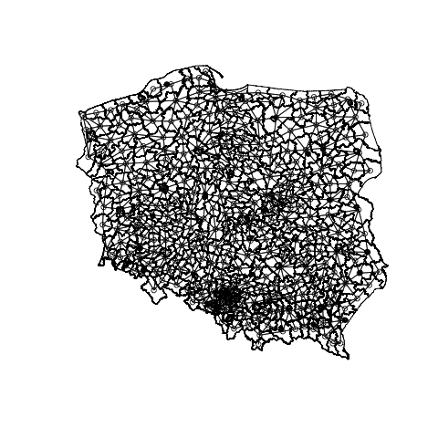
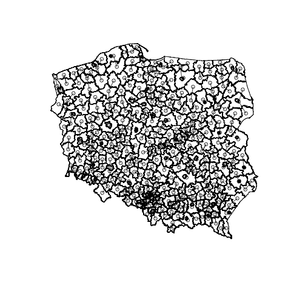
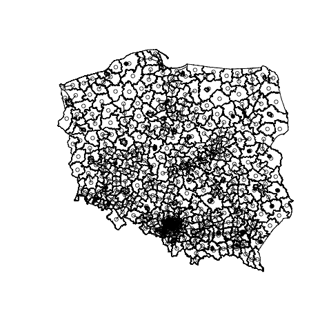
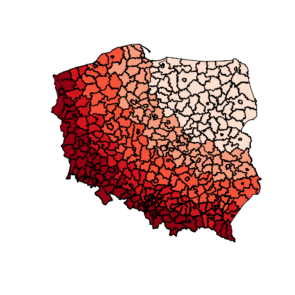
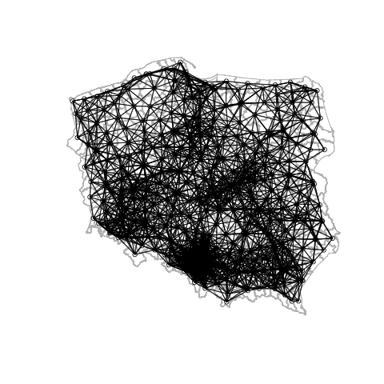

```{r setup, include=FALSE}
knitr::opts_chunk$set(echo = TRUE)
knitr::opts_chunk$set(warning = FALSE)
knitr::opts_chunk$set(message = FALSE)
knitr::opts_chunk$set(eval = TRUE)
```


### Installing and loading necessary packages

```{r, message=FALSE, warning=TRUE}
# X11.options(type = "cairo")
# setting a seed so we always have the same results for sampling
set.seed(1234)
if (!"pacman" %in% installed.packages()[, 1]) {
  install.packages("pacman")
}
# p_load works as install.packages (if needed) and library and once
pacman::p_load(
  spdep,
  rgdal,
  maptools,
  sp,
  RColorBrewer,
  classInt,
  GISTools,
  maps,
  ggplot2,
  stringdist,
  stringr,
  classInt
)
```

### Data

```{r, message=FALSE, warning=FALSE}
# It is important to understand that shapefile is a simple folder with a collection of files.
# For example a folder `Panstwo` contains files:
# list.files("Panstwo")

# reading maps with `rgdal::` package.

pl_raw <- readOGR("../Visualizations/Panstwo") # 1 jedn.
voi_raw <- readOGR("../Visualizations/wojewodztwa") # 16 jedn.
pov_raw <- readOGR("../Visualizations/powiaty") # 380 jedn.

# Panel per poviat

# reading data into dataframe
data_nts <- read.table("../Visualizations/data_nts4_2019.csv", sep = ";", dec = ",", header = TRUE)
data_nts15 <- data_nts[data_nts$year == 2015, ]

# Lubelskie district companies

firms <- read.csv("../Visualizations/geoloc_data.csv", header = TRUE, dec = ",", sep = ";")
```

### Own function for saving the plot calls

For plotting I will use my own `plot_2png` function.
It simply evaluates the provided code for certain plot/plots and saves it as a png file.
We could reuse these visualizations e.g. on the web page as static files. Moreover in Mac OS RStudio (my environment not precisely yours) the graphics system seems to be extremely inefficient. I even commented on the already existing issue on [github](https://github.com/rstudio/rstudio/issues/3866).
Later ggplot objects will be saved with the `ggsave` function.

```{r}
plot_2png <- function(x, filename) {
  x <- substitute(x)
  stopifnot(is.call(x))
  filename_path <- file.path(getwd(), filename)
  file.create(filename_path)
  png(filename_path)
  eval(x)
  res <- dev.off()
}
```


### Changing Projections


```{r}
pl <- spTransform(pl_raw, CRS("+proj=longlat +datum=NAD83"))
voi <- spTransform(voi_raw, CRS("+proj=longlat +datum=NAD83"))
pov <- spTransform(pov_raw, CRS("+proj=longlat +datum=NAD83"))
```


## Basic types of neighborhood (NB) matrices and the spatial weights (W) matrices

A key element of spatial modeling is the structure of the neighborhood, on which the modeling of the neighbor interaction is based. In practice, one uses few types of neighborhood matrices in modelling:
- Contiguity matrix (matrix of common border)
- Matrix of k nearest neighbors
- Matrix of neighbors within d km (neighbors in radius of d km)

Neighborhood matrices define a neighborhood with dummies. NB matrices do not take into account the weights - strength of spatial interaction. 

One adds the weights to obtain the spatial weights matrix. Weighing of neighborhood relations is most often performed in two ways:
- row-standardizing to 1 (ie. dividing the values in the row by the number of elements in a row)
- weighing with the distance (inverse distance)

On this basis, there are following basic types of spatial weight matrices:
- Contiguity matrix (row standardized to one)
- Matrix of k nearest neighbors (knn)
- Matrix of neighbors within d km (d near neigh…)
- Inverse distance matrix (de facto knn for k = n-1 weighted by distance)
- Inverse squared distance matrix (de facto KNN for k = n-1 weighted square of the distance)

The choice of the spatial weights matrix modeling is an important step. When a-priori selected matrix does not correspond to a real relationship, there is a need to find more adequate spatial weights matrix.

Basic functions in R for handling the spatial weights matrix

`poly2nb`				Construct neighbours list from polygon list
`nb2listw`  			Spatial weights for neighbours lists
`knearneigh`	    	K nearest neighbours for spatial weights
`dnearneigh`     	Neighbourhood contiguity by distance
`knn2nb`         	Neighbours list from knn object
`is.symmetric.nb`	Test a neighbours list for symmetry
`make.sym.nb(nb)`	Makes a non-symmetric list symmetric by adding neighbors
`lag.listw`       	Spatial lag of a numeric vector
`nbdists`         	Spatial link distance measures
`nb2mat`   			Spatial weights matrices for neighbours lists
`mat2listw`      	Convert a square spatial weights matrix to a
`nblag`           	Higher order neighbours lists

General rule: 
- for drawing use objects of class nb 
- for calculations use objects of class listw

Sample codes in R – spatial weights matrix

# Spatial weights matrix – contiguity matrix

```{r}
cont.nb<-poly2nb(as(pov, "SpatialPolygons"))
cont.listw<-nb2listw(cont.nb, style="W")
cont.listw # summary of matrix
```


# coordinates of nts4 units 
#(geometric center of gravity)
```{r}

crds<-coordinates(pov)
colnames(crds)<-c("cx", "cy")
```


# plot of neighbourhood


```{r}
plot_2png({
plot(pov) # contour map
plot(cont.nb, crds, add=TRUE)
}, "images/nb1.png")
```



# conversion to class matrix
```{r}
cont.mat<-nb2mat(cont.nb)
cont.mat[1:10, 1:10]
```

# spatial weights matrix – k nearest neighbours


```{r}
nts4.knn<-knearneigh(crds, k=1) # knn class (k=1)
nts4.knn.nb<-knn2nb(nts4.knn)

```


```{r}
plot_2png({
plot(pov)
plot(nts4.knn.nb, crds, add=TRUE)
}, "images/nb2.png")
```



# checking for matrix symmetry

```{r}
print(is.symmetric.nb(nts4.knn.nb))
nts4.sym.knn.nb<-make.sym.nb(nts4.knn.nb)
print(is.symmetric.nb(nts4.sym.knn.nb))

```

# knn as listw class
```{r}
nts4.sym.knn.listw<-nb2listw(nts4.sym.knn.nb)
```


# spatial weights matrix – neighbours in radius of d km
```{r}
conti30<-dnearneigh(crds, 0, 30,longlat=TRUE) # conti30 is nb class
conti30.m<-nb2mat(conti30, zero.policy=TRUE)
```

```{r}
plot_2png({
plot(pov)
plot(conti30, crds, add=TRUE)
}, "images/nb3.png")
```




# let’s see who does not have a neighbour

```{r}
a<-colMeans(t(conti30.m))
pov@data$a<-a

plot_2png({
spplot(pov, "a")
}, "images/sp1.png")

```


# at what distance all units have at least one neighbour?

# implicitly k=1, list of closests neighbours
```{r}
kkk<-knn2nb(knearneigh(crds)) 
```


# max of distances between clostests neighbours  we get distance
```{r}
all<-max(unlist(nbdists(kkk, crds))) 
```

# neighbours in radius of d km 
# guaranted that all regions have at least one neighbor

```{r}
all.nb<-dnearneigh(crds, 0, all) 

summary(all.nb, crds)
plot(pov, border="grey") 
plot(all.nb, crds, add=TRUE)
conti.all<-nb2listw(all.nb)
```

# spatial weights matrix - inverse distance matrix


```{r}
nts4.knn<-knearneigh(crds, k=379) # we have 380 units on the map
nts4.nb<-knn2nb(nts4.knn)
dist<-nbdists(nts4.nb, crds)  
dist1<-lapply(dist, function(x) 1/x)  # object of listw class
nts4.dist.listw<-nb2listw(nts4.nb, glist=dist1)  # listw class object – spatial weights according to distance criterion
```

# converting to matrix class

```{r}
dist.mat<-listw2mat(nts4.dist.listw)
summary(dist.mat) # statistics of weights of all regions
```

# plot of inverse distance weights for single region
```{r}
pov.df<-as.data.frame(pov)
pov.df$jpt_nazwa # Warszawa is 151
x<-dist.mat[,151]
summary(x)
cols<-rev(heat.colors(11))
```

#brks<-(0:7)*5


```{r}
brks<-c(0, 0.001, 0.0015, 0.002, 0.0025, 0.003, 0.005, 0.01, 0.015, 0.02, 0.025)
plot(pov, col=cols[findInterval(x, brks)])
plot(voi, add=TRUE, lwd=2)
legend("bottomleft", legend=brks, pt.bg=cols, bty="n", pch=22, cex=0.8)
title(main="Inverse distance weigths", sub="In legend intervals from….%")
```


# summary of spatial weights matrix
```{r}
summary(cont.nb) # matrix in nb class

```


```{r}
cont.nb.listw<-nb2listw(cont.nb)
summary(unlist(cont.nb.listw$weights))

```


```{r}
cont.nb.mat<-nb2mat(cont.nb)
summary(cont.nb.mat)
```

```{r}
table(card(cont.nb)) # cardinalities, listing possible number of links and counting observations for given level
```


```{r}
print(cont.nb.mat)
cont.listw$weights # lists spatial weights

```

Task 1: Visualise distance of all poviats from Suwalki

```{r}
which_suwalki <- which(grepl("suwa", pov@data$jpt_nazwa_))
crds <- coordinates(pov)

dists <- sp::spDistsN1(crds, cords[which_suwalki,], longlat = TRUE)

plot_2png({
choropleth(pov, dists)
}, "images/ex1.png")


```




Task 2: Check how many neighbors have the counties (nts4 units, powiats) under criterion of neighbors within a radius of 70 km. Check out what changes were introduced in the matrix after make.symm.nb() command.

```{r}
a.nb<-dnearneigh(crds, 0, 70, longlat = TRUE) 

#summary(all.nb, crds)

#conti.all<-nb2listw(all.nb)

plot_2png({
plot(pov, border="grey") 
plot(a.nb, crds, add=TRUE)
}, "images/ex2.png")

sym.a.nb<-make.sym.nb(a.nb)

plot_2png({
plot(pov, border="grey") 
plot(sym.a.nb, crds, add=TRUE)
}, "images/ex2b.png")

#nothing
is.symmetric.nb(a.nb)
```




Task 3: For the contiguity matrix, draw a map with colors for the average weight of a neighbour


```{r}
weis <- apply(nb2mat(cont.nb), 1, max)
plot_2png({
choropleth(pov, 1/weis)
}, "images/ex3.png")
```

