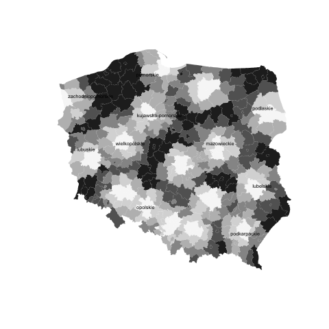

```{r setup, include=FALSE}
knitr::opts_chunk$set(echo = TRUE)
knitr::opts_chunk$set(warning = FALSE)
knitr::opts_chunk$set(message = FALSE)
knitr::opts_chunk$set(eval = TRUE)
```

### Installing and loading necessary packages

```{r, message=FALSE, warning=TRUE}
# X11.options(type = "cairo")
# setting a seed so we always have the same results for sampling
set.seed(1234)
if (!"pacman" %in% installed.packages()[, 1]) {
  install.packages("pacman")
}
# p_load works as install.packages (if needed) and library and once
pacman::p_load(
  spdep,
  rgdal,
  maptools,
  sp,
  RColorBrewer,
  classInt,
  GISTools,
  maps,
  ggplot2,
  stringdist,
  stringr,
  classInt
)
search() # see active packages - the order is important if we have names conflicts
# why sp was loaded before spdep
# because it is spdep dependency https://cran.r-project.org/web/packages/spdep/index.html

# when I want to work from base R 
# setwd("/Users/maciejnasinski/Documents/Rpackages/SDA/Visualizations")
```

### Data

```{r, message=FALSE, warning=FALSE}
# It is important to understand that shapefile is a simple folder with a collection of files.
# For example a folder `Panstwo` contains files:
# list.files("Panstwo")

# reading maps with `rgdal::` package.

pl_raw <- readOGR("Panstwo") # 1 jedn.
voi_raw <- readOGR("wojewodztwa") # 16 jedn.
pov_raw <- readOGR("powiaty") # 380 jedn.

# Panel per poviat

# reading data into dataframe
data_nts <- read.table("data_nts4_2019.csv", sep = ";", dec = ",", header = TRUE)
data_nts15 <- data_nts[data_nts$year == 2015, ]

# Lubelskie district companies

firms <- read.csv("geoloc_data.csv", header = TRUE, dec = ",", sep = ";")
```


Each object is of the class `class(pl_raw)` like pl, voi and pov are a [S4 class](http://adv-r.had.co.nz/S4.html). The class will influence how we will interact with them. 
TL;DR S4 is one of the most popular OOP programming R tool.
It is easy to recognize that S4 methods and attributes are accessed by usage of `@`, like `object@METHOD` or `object@SLOT`.


```{r}
class(pl_raw)
isS4(pl_raw)
```

### Own function for saving the plot calls

For plotting I will use my own `plot_2png` function.
It simply evaluates the provided code for certain plot/plots and saves it as a png file.
We could reuse these visualizations e.g. on the web page as static files. Moreover in Mac OS RStudio (my environment not precisely yours) the graphics system seems to be extremely inefficient. I even commented on the already existing issue on [github](https://github.com/rstudio/rstudio/issues/3866).
Later ggplot objects will be saved with the `ggsave` function.

```{r}
plot_2png <- function(x, filename) {
  x <- substitute(x)
  stopifnot(is.call(x))
  filename_path <- file.path(getwd(), filename)
  file.create(filename_path)
  png(filename_path)
  eval(x)
  res <- dev.off()
}
```

Working Directory

```{r}
getwd()
# might be changed with setwd("/path/")
```


### Changing Projections

[TL; DR 3D model to 2D model](https://www.nceas.ucsb.edu/sites/default/files/2020-04/OverviewCoordinateReferenceSystems.pdf)


CRS before transformation and the box dimensions.
We will see how they change after `spTransform` usage.

```{r}
pl_raw@proj4string
pl_raw@bbox
```

```{r}
pl <- spTransform(pl_raw, CRS("+proj=longlat +datum=NAD83"))
voi <- spTransform(voi_raw, CRS("+proj=longlat +datum=NAD83"))
pov <- spTransform(pov_raw, CRS("+proj=longlat +datum=NAD83"))
```

```{r}
pl@proj4string
pl@bbox
```

### Method plot.S4spClass

[Dispatch](https://adv-r.hadley.nz/s4.html#s4-dispatch)

It is not as easy to find out used a s4 package method.
Of course `sp::plot` is not a default `base::plot`.

```{r}
sp::plot
```

```{r}
plot_2png(
  {
    plot(pl)
  },
  "images/default_plot_pl.png"
)

plot_2png(
  {
    plot(voi)
  },
  "images/default_plot_voi.png"
)

plot_2png(
  {
    plot(pov)
  },
  "images/default_plot_pov.png"
)
```


### Base R 

```r
# extracting data_ntsbase from shapefile
pov<-as.data_nts.frame(pov) # or pov@data_nts 
summary(data_nts)
names(data_nts)
# Basic, but important operations in R

# overview of data_nts
summary(data_nts) 	# summarizing the data_nts
names(data_nts)  	# checking the heads of data_nts
class(data_nts)	# checking the class of object
head(data_nts) 	# displaying first six operations
tail(data_nts) 	# displaying last six operations

summary(data_nts$XA03) # summary of selected variable
summary(data_nts$XA03[data_nts$rok==2006]) # …of selected variable in given year
levels(data_nts$region_name) # levels of qualitative variable

# data_nts subset
# subset for given year and selected level of qualitative variable 
sub06<-data_nts[data_nts$year==2006 & data_nts$region_name=="Pomorskie",]
sub06
summary(sub06)

data_nts1<-data_nts[1:10, c(-3, -7)] #rows from 1 to 10, without columns 3 & 7

# adding new variable into data_ntsset
# employed (XA15) related to population in productive age (XA08)
data_nts$XA15pc<-data_nts$XA15/data_nts$XA08
summary(data_nts$XA15pc)

# class of objects
class(data_nts)
class(pov)
```

Going inside spatial objects

```r
levels(pov@data$jpt_nazwa_) # levels of spatial units from shapefile database
str(pov)
slotNames(pov)
slotNames(pov@polygons[[1]]) # slot names within the slots
pov@bbox
lapply(pov@polygons, slot, "ID")
unlist(lapply(pov@polygons, slot, "ID"))
```


### Getting raw data - 2D

```{r}
pl_coords <- raster::geom(pl)
pl_coords2 <- ggplot2::fortify(pl)
pl_coords3 <- as.data.frame(as(as(pl, "SpatialLinesDataFrame"), "SpatialPointsDataFrame"))
```

We could even use a well know ggplot2 with raw data.

```{r, message = FALSE}
ggploty <- ggplot(data.frame(pl_coords), aes(x = x, y = y)) +
  geom_polygon()
ggsave("images/pl_geom_ploygon.png", ggploty)
```


### Contour map with centroids

Plot multilayer contour administrative map. Add centroids as points. 

spatial coordinates of poviat centroids

Number of coordinates (centroids) will be the same as the number of shapes (like districts).
That is why we have only one coordinate for `pl`.

```{r}
coordinates(pl)
```

```{r}
crds_pov <- coordinates(pov)
crds_voi <- coordinates(voi)
```

contour map

```{r}
plot_2png(plot(pl, lwd = 3), "images/pl_sp_plot_lwd3.png")
```


```{r}
plot_2png(
  {
    plot(pl, lwd = 3)
    plot(pov, add = TRUE, col = alpha("blue", 0.4))
    points(crds_pov, pch = 21, bg = "red", cex = 0.8)
  },
  "images/pl_pov_plot.png"
)
```


```{r}
plot_2png(
  {
    plot(pl, lwd = 3)
    plot(voi, add = TRUE, lwd = 2, col = alpha("green", 0.4))
    points(crds_voi, pch = 21, bg = "red", cex = 0.8)
  },
  "images/pl_voi_plot.png"
)
```


```{r}
pov.df <- as.data.frame(pov) # lack of voivodeship identifier

plot_2png(
  {
    plot(pov)
    pointLabel(crds_pov, as.character(pov.df$jpt_nazwa_), cex = 0.6)
  },
  "images/pov_with_labes.png"
)
# labels of regions
```


```{r}
plot_2png(
  {
    plot(pov)
    text(crds_pov, as.character(pov.df$jpt_nazwa_), cex = 0.6)
  },
  "images/pov_with_text.png"
)
```


For interactive plot

```r
plot(pov)
identify(crds_pov, labels=as.character(pov.df$jpt_nazwa_), cex=0.6)
```

graphical add-ins

Basic contour maps can be enriched with additional graphical elements. 
These are, for example: map scale - drawn with the map.scale() command from the maps:: package, arrow pointing north - drawn by north.arrow() from the GISTools:: package, map scale applied with the degAxis(1) and degAxis(2) from the sp:: package, a rose showing compass directions - drawn by compassRose() from the sp:: package, geographic grid - drawn by plot(gridlines()) from the sp:: package. 

```{r}
plot_2png(
  {
    plot(pov)
    map.scale(x = 14.5, y = 49.3, ratio = FALSE, relwidth = 0.2) # using maps::
    north.arrow(xb = 15.9, yb = 49.8, len = 0.1, lab = "N", cex.lab = 0.8, col = "gray10") # using GISTools::
  },
  "images/pov_arrow.png"
)
```


```{r}
plot_2png(
  {
    plot(voi)
    degAxis(1) # using sp::
    degAxis(2)
    compassRose(15, 49.7, rot = 0, cex = 1) # using sp::
    plot(gridlines(voi), add = TRUE) # using sp::
  },
  "images/pov_compass.png"
)
```


Contour map with color layer

Plot poviat map with layer for voivoidship id  

with findInterval() from the base:: package

```{r}
regions <- data_nts$region_nr[data_nts$year == 2015]
uregions <- unique(regions)
nregions <- length(uregions)
uregions
```

```{r}
# use colours
cols <- c("blue3", "cornflowerblue", "seagreen1", "yellow", "chocolate1", "orangered1", "brown3", "coral4", "salmon4", "aquamarine3", "darkgreen", "chartreuse3", "cyan4", "darkred", "darkviolet", "cadetblue3") # , "blue")

identical(length(cols), nregions)

# or
# cols <- sample(colors(), nregions)
```


```{r}
identical(length(regions), nrow(pov))
identical(length(cols[match(regions, uregions)]), nrow(pov))
```

```{r}
plot_2png(
  {
    par(mar = c(1, 1, 1, 1)) # contour plot & each region with own colour layer
    plot(pov, col = cols[match(regions, uregions)], border = "grey80")
    plot(voi, add = TRUE, lwd = 1)
    par(mar = c(5, 4, 4, 2))
    # labels of provincial names
    voi.df <- as.data.frame(voi)
    text(crds_voi, label = voi.df$jpt_nazwa_, cex = 0.7, font = 2)
  },
  "images/par_pov_voi_cols.png"
)
```


use shading

```{r}
dens <- (1:nregions) * 3

plot_2png(
  {
    par(mar = c(1, 1, 1, 1))
    plot(pov, density = dens[match(regions, uregions)], border = "grey80")
    plot(voi, add = TRUE, lwd = 1)
    par(mar = c(5, 4, 4, 2))
  },
  "images/par_pov_voi_dens.png"
)
```


 
with findColours()

Plot poviat map with layer for unemployment rate (XA21) 

```{r}
unemploy <- data_nts15$XA21
```

We want to create a plot with a certain color assigned for each interval. Moreover the proper legend is created.

```{r}
nintervals <- 8
colors <- brewer.pal(nintervals, "BuPu") # choice of colors
breaks <- c(0, 5, 10, 15, 20, 25, 30, 35, 40) # N+1 points
classes <- classIntervals(unemploy, nintervals,
  style = "fixed",
  fixedBreaks = breaks
) # fixedBreaks might be provided only when style = "fixed"
# when e.g. style = "kmeans" then we get intervals automatically
color.table <- findColours(classes, colors)

plot_2png(
  {
    plot(pov, col = color.table)
    plot(voi, lwd = 2, add = TRUE)
    legend("bottomleft",
      legend = names(attr(color.table, "table")),
      fill = colors, cex = 0.8, bty = "n"
    )
    title(main = "Unemployment rate in poviats in 2015")
  },
  "images/brew_plot.png"
)
```


with GISTools::choropleth() 

Plot a map of distances between poviats and regional main cities 

```{r}
pov_dists <- data_nts15$dist
summary(pov_dists)

# almost all goes automatically
plot_2png(
  {
    choropleth(pov, pov_dists)
  },
  "images/choropleth_plot.png"
)
```


with setting some parameters

```{r}
shades <- auto.shading(pov_dists, n = 6, cols = brewer.pal(6, "Purples"))

plot_2png(
  {
    choropleth(pov, pov_dists, shading = shades)
  },
  "images/choropleth_shading_plot.png"
)
```


```{r}
# division into intervals by mean and std.dev,
shades <- auto.shading(pov_dists, n = 6, cols = add.alpha(brewer.pal(6, "Greens"), 0.35), cutter = sdCuts)

plot_2png(
  {
    choropleth(pov, pov_dists, shading = shades)
    choro.legend(14.3, 50.2, shades, under = "below", over = "above", between = "to", cex = 0.6, bty = "n")
  },
  "images/choropleth_legend.png"
)
```


### With colorRampPalette() from grDevices::

For a defined number of intervals (nclr - number of colors), the palette of shades is chosen (here Reds). The brewer.pal() command creates a color vector. Next, the colorRampPalette() command from the grDevices:: package "pulls" the color vector and creates an interpolating function (fillRed) that continuously transcodes the variable values into a color vector. The colcode object contains the names of colors that are drawn with the ordinary plot() command. The first county layer (NTS4) contains information on the colors of the regions according to the colcode object, while the county contours were omitted by the option lty=0. The second regional layer (NTS2) has been superimposed on the previous graph thanks to the add=TRUE option, while voivodship contours are drawn in light gray (border = "gray60"). The colorlegend() command from the shape:: package creates a vertical bar that specifies the color scale. The way of applying the scale of the map and the direction of the rose is explained earlier. 

```{r, message=FALSE}
pacman::p_load(
  quickPlot,
  wesanderson,
  quickPlot,
  viridis,
  scales,
  RColorBrewer,
  hexbin,
  shape
)
```


```{r}
# already defined unemploy <- data_nts$XA21[data_nts$year == 2015]
maxy <- 40
breaks <- c(0, 5, 10, 15, 20, 25, 30, 35, 40) # used in the legend N+1
nclr <- 8
plotclr <- brewer.pal(nclr, "Reds") # from the RColorBrewer package
fillRed <- colorRampPalette(plotclr) # from the grDevices package
colcode <- fillRed(maxy)[round(unemploy) + 1] # fillRed is a function

plot_2png(
  {
    plot(pov, col = colcode, lty = 0)
    plot(voi, add = TRUE, lwd = 1, border = "gray60")
    #
    maps::map.scale(x = 18.0, y = 49.3, ratio = FALSE, relwidth = 0.2, metric = TRUE)
    compassRose(16, 49.8, rot = 0, cex = 1) # from the sp package

    colorlegend(posy = c(0.05, 0.9), posx = c(0.9, 0.92), col = fillRed(maxy), zlim = c(0, maxy), zval = breaks, main.cex = 0.9) # from the shape:: package

    title(main = "Unemployment rate in 2015 r.", sub = "At the NTS4 level, according to the Central \n Statistical Office data")
  },
  "images/pl_voi_unemploy_colors.png"
)
```


### Colours

Colours palettes can be plotted with: image(), plot() for raster()
One can display colours using rgb(), colors(), demo("colors")

generating random colors and plotting with image()

```r
a<-rgb(runif(21,0,1), runif(21,0,1), runif(21,0,1))
a
a.dim1<-length(a)
image(1:a.dim1, 1, as.matrix(1:a.dim1), col=a, xlab="grDevices::rgb() / random colors ") # vertical stripes with colours

# plotting names of colours in raster
colors() # the first few lines of color names
library(raster)
r<-raster(xmn=0, xmx=22, ymn=0, ymx=30, nrows=30, ncols=22)
r[]<-1:(30*22)
plot(r, col=colors()) #rasters (cells) with colours
```

change the English names of colors into RGB components
works as well for colors expressed in hexadecimal

```r
col2rgb(c("azure", "azure1", "azure2"), alpha=FALSE)
col2rgb(c("#4B424F", "#BFD15C", "#A44845"), alpha=FALSE)

# display RColorBrewer colours
display.brewer.all() # all pallets from the package
display.brewer.pal(11,'Spectral') # displaying the palette
display.brewer.pal(9,'OrRd') # displaying the palette
cols<-brewer.pal(n=5, name="RdBu") # saving selected colors
#[1] "#CA0020" "#F4A582" "#F7F7F7" "#92C5DE" "#0571B0"
```

```r
# see wensaderson:: colours
cols1<-wes_palette("GrandBudapest1", 4, type="discrete")
cols1
cols2<-wes_palette("GrandBudapest1", 21, type="continuous")
cols2
```


```r
# generate 21 divergent colors with quickPlot::divergentColors() 

# palette from the command example
a<-divergentColors("darkred", "darkblue", -10, 10, 0, "white")
a
a.dim1<-length(a)
image(1:a.dim1, 1, as.matrix(1:a.dim1), col=a, xlab="quickPlot::divergentColors() / darkred-darkblue")

# another palette
a<-divergentColors("chocolate4", "peachpuff4", -10, 10, 0, "white")
a
a.dim1<-length(a)
image(1:a.dim1, 1, as.matrix(1:a.dim1), col=a, xlab="quickPlot::divergentColors() / chocolate-peachpuff")
```

viridis:: with colours for color-blind people. 
colours divided into five palettes (opt): "magma" ("A"), "inferno" ("B"), plasma (C), viridis (D) and cividis (E) 

```r
viridis.map

col1<-viridis(15, option="D") # the default viridis colors
show_col(col1) 

col2<-viridis(15, option="B") # inferno palette
show_col(col2)

# coloured hexagons circled 
ggplot(data.frame(x=rnorm(10000),y =rnorm(10000)), aes(x=x, y=y)) +
 geom_hex() + coord_fixed() + scale_fill_viridis() + theme_bw() 
```


Look also into:
scales:: - helps in range of color selection and division of variables into ranges, includes data transformations, data management and division into intervals, as well as advanced color management from various palettes. 
colorspace:: - allows advanced color conversions and advanced creation of one’s own palettes. 
smoothScatter() function from the graphics:: package and the colorRamp() and colorRampPalette() functions from the grDevices:: basic package, which return functions that smooth colors and match colors to the next variable values. 
RImagePalette:: - takes colors from the analyzed photo / graph and creates a palette, which allows one to replicate colors. 
quickPlot::getColors() - color management for raster graphics 

Maps with points
reading point data

```{r}
plot_2png(
  {
    # scatterplot of empirical data
    plot(voi[voi@data$jpt_nazwa_ == "lubelskie", ])
    points(firms$coords.x1, firms$coords.x2, pch = ".")
  },
  "images/voi_lubelskie.png"
)
```


```{r}
# scatterplot of empirical data with sp:spplot()
firms.lim1 <- firms[, c("GR_LPRAC", "podreg", "coords.x1", "coords.x2")] # selection of variables
# `coordinates<-` assign function
coordinates(firms.lim1) <- c("coords.x1", "coords.x2") # class change
class(firms.lim1)
```

```{r}
plot_2png(
  {
    print(spplot(firms.lim1))
  },
  "images/spplot_firms.png"
)
```


```{r}
# selected variables: x and y coordinates, employment, sector
firms.sel <- firms[sample(nrow(firms), 2000), c("coords.x1", "coords.x2", "zatr", "SEK_PKD7")] # selected columns
colnames(firms.sel) <- c("x", "y", "empl", "sector") # names change
coordinates(firms.sel) <- c("x", "y") # class change

plot_2png(
  {
    par(mar = c(1, 1, 1, 1)) # chart margins
    plot(firms.sel, pch = 1, cex = sqrt(firms.sel$empl) / 3, axes = TRUE)
    v <- c(5, 30, 150, 600) # the scale of the legend
    legend("topleft", legend = v, pch = 1, pt.cex = sqrt(v) / 10, bty = "n")
    plot(voi[voi@data$jpt_nazwa_ == "lubelskie", ], add = TRUE, lwd = 2)
    par(mar = c(5, 4, 4, 2))
  },
  "images/firms_sel.png"
)
```


with findInterval()

```{r}
subregs <- firms$podreg
locs <- firms[, c("coords.x1", "coords.x2")]
summary(subregs)
brks <- c(1, 2, 3, 4)
cols <- c("blue3", "cornflowerblue", "seagreen1", "green2")
subregs_interval <- findInterval(subregs, brks)
# limited countour, limited points

plot_2png(
  {
    plot(voi[voi@data$jpt_nazwa_ == "lubelskie", ])
    points(locs,
      col = cols[subregs_interval], pch = 21, cex = 0.7,
      bg = cols[subregs_interval]
    )
    legend("bottomleft", legend = brks, fill = cols, cex = 0.8, bty = "n")
    title(main = "Points - colors by values")
  },
  "images/voi_subregs.png"
)
```


```{r}
# poviats represented in centroids
salary <- data_nts$XA14[data_nts$year == 2015]
summary(salary)
crds <- coordinates(pov)
brks <- c(60, 80, 100, 120, 140, 160, 180)
size <- (brks / 100) * 1.2
cols <- brewer.pal(7, "Reds")
salary_intervals <- findInterval(salary, brks)

plot_2png(
  {
    plot(pov, border = "grey90") # Fig.2.10b
    plot(voi, border = "grey50", add = TRUE, )
    points(crds,
      col = cols[salary_intervals],
      cex = size[salary_intervals], pch = 21, bg = cols[salary_intervals]
    )
    legend("bottomleft", legend = brks, pt.bg = cols, pt.cex = size, bty = "n", pch = 21)
    title(
      main = "Average salary in Poland = 100% year 2015",
      sub = "In the legend, the interval from …"
    )
  },
  "images/pov_voi_salary.png"
)
```


### Fragment of the map

plot a fragment of the map – data, poviat and voivodship of Lubelskie region

regional map - for the Lubelskie Voivodeship
version A

```r
voi.df <- as.data.frame(voi)
lub.voi <- voi[voi.df$jpt_nazwa_ == "lubelskie", ]
plot(lub.voi, main = "Lubelskie NTS2")

# version B
plot(voi[voi@data$jpt_nazwa_ == "lubelskie", ])

# map of poviats within the Lubelskie Voivodeship
# pov.df<-as.data.frame(pov) #  lack of voivodeship identifier
data_nts15 <- data_nts[data_nts$year == 2015, ]
identical(nrow(data_nts15), nrow(pov))
lub.pov <- pov[data_nts15$region_name == "Lubelskie", ]

plot(lub.pov, main = "Lubelskie NTS4")
plot(lub.voi, add = TRUE, lwd = 2)
```

### Extra tasks

1. Plot a contour map of average salary (Poland=100). Label interactively the mostly outlying regions. 

Because `identify` is unstable in my environment I applied labels for all povs with XA14 bigger than 100.

```{r}
salary <- data_nts15$XA14
top_pov <- stringr::str_to_lower(data_nts15$poviat_name1[salary > 100])
pov_nams <- stringr::str_to_lower(pov@data$jpt_nazwa_)
which_top <- pov_nams %in% top_pov
crds_pov <- coordinates(pov[which_top, ])

plot_2png(
  {
    choropleth(pov, salary)
    text(crds_pov, labels = pov_nams[which_top], cex = 0.6)
    # identify(crds_pov, labels = pov_nams[which_top], cex=0.6)
  },
  "images/ex1_choropleth_top.png"
)
```


2. Plot poviat map for distances between poviats and regional core cities – use palette of grey colours. Erase administrative contours using “transparent” colour. Label the regional core cities. 

```{r}
shades <- auto.shading(pov_dists, n = 6, cols = brewer.pal(6, "Greys"))

plot_2png(
  {
    choropleth(pov, pov_dists, shading = shades, border = "transparent")
    text(crds_voi, labels = voi@data$jpt_nazwa_, cex = 0.6)
    # identify(crds_pov, labels = pov_nams[which_top], cex=0.6)
  },
  "images/ex2_choropleth_voi.png"
)
```



3. Draw a map of average salary in a selected voivodship, other than Lubelskie. Apply poviat name labels using the text () command.

Not clear 

```{r}
voi_mean <- tapply(data_nts15$XA14, 
                   list(data_nts15$region_name), 
                   mean, na.rm = TRUE)
voi_mean2 <- voi_mean[names(voi_mean) != "Lubelskie"]

voi_crds <- coordinates(voi)
plot_2png({
  choropleth(voi[voi@data$jpt_nazwa_ != "lubelskie",], voi_mean2)
  text(coordinates(pov), pov@data$jpt_nazwa_)
}, "images/ex3_voi.png")
```


4. For point (Lubelskie voivodship) data plot a map of distance between randomly selected 5000 points and powiat cities: Biała Podlaska, Zamość, Chełm, Lublin. Connect the points with the nearest cities. Add poviat countours. Use spDistsN1() command. 


```{r}
sub <- sample(dim(firms)[1], 5000, replace = FALSE)
firms.sub <- firms[sub, ]
biała_podlaska <- c(23.11652, 52.03238)
zamość <- c(23.2134931, 50.7213773)
chełm <- c(23.4196655, 51.1355623)
lublin <- c(22.4236853, 51.2180254)

dists_zcl <- lapply(list(biała_podlaska, zamość, chełm, lublin), function(x) sp::spDistsN1(as.matrix(firms.sub[, 12:13]), x, longlat = TRUE))

names(dists_zcl) <- c("biała_podlaska", "zamość", "chełm", "lublin")

min_dist <- apply(data.frame(dists_zcl), 1, which.min)

which_lubelskie <- stringr::str_to_lower(data_nts15$poviat_name1[data_nts15$region_nr == 6])

firms.sub.sp <- firms.sub
coordinates(firms.sub.sp) <- c("coords.x1", "coords.x2")

# nintervals <- 4
# colors <- brewer.pal(nintervals, "BuPu") # choice of colors
# classes <- classIntervals(min_dist, nintervals,
#   style = "kmeans"
# )
# color.table <- findColours(classes, colors)
#
# voi.sel <- voi
# proj4string(voi.sel) <- CRS("+proj=longlat +datum=NAD83")
# pov.sel <- pov
# proj4string(pov.sel) <- CRS("+proj=longlat +datum=NAD83")
#
# pov_lubelskie <- over(pov.sel, voi.sel[voi.sel@data$jpt_nazwa_ == "lubelskie", ])

which_lubelskie_utf8 <- iconv(which_lubelskie, "windows-1250", "utf-8")
pov_names_utf8 <- iconv(pov@data$jpt_nazwa_, "windows-1250", "utf-8")
best_match <- unlist(lapply(which_lubelskie_utf8, function(x) which.min(stringdist::stringdist(pov_names_utf8, x))))

plot_2png(
  {
    plot(pov[best_match, ])
    points(firms.sub.sp, col = min_dist, pch = ".", cex = 3)
  },
  "images/ex4_viz.png"
)
```


5. Let’s use over(). Below you have the structure of the code, which needs some corrections. The goal is to plot in red the points, which belong to selected municipality (gmina). 

```{r}
# structure of the code
voi.df <- as.data.frame(voi)
pov.sel <- pov[data_nts15$poviat_name1 == "Powiat Lublin", ]
firms.sp <- firms
coordinates(firms.sp) <- c("coords.x1", "coords.x2") # class change
proj4string(firms.sp) <- CRS("+proj=longlat +datum=NAD83")
pov.sel <- spTransform(pov.sel, CRS("+proj=longlat +datum=NAD83"))
# firms.sp <- spTransform(firms.sp, CRS("+proj=longlat +datum=NAD83"))

# method with over()
locs.lim <- over(firms.sp, pov.sel)

plot_2png(
  {
    par(mar = c(1, 1, 1, 1))
    plot(voi[voi.df$jpt_nazwa_ == "lubelskie", ]) # plot of whole voivodeship
    locs <- firms[, 12:13] # all points of the class data.frame
    points(locs, col = "grey80", pch = ".", cex = 0.7) # plot of all points
    points(locs[which(locs.lim$jpt_nazwa_ == "powiat Lublin"), ], cex = 0.7, col = "red", pch = ".")
    plot(pov.sel, add = TRUE, border = "red") # plot of  selected poviat
    par(mar = c(5, 4, 4, 2))
  },
  "images/ex5_viz.png"
)
```

